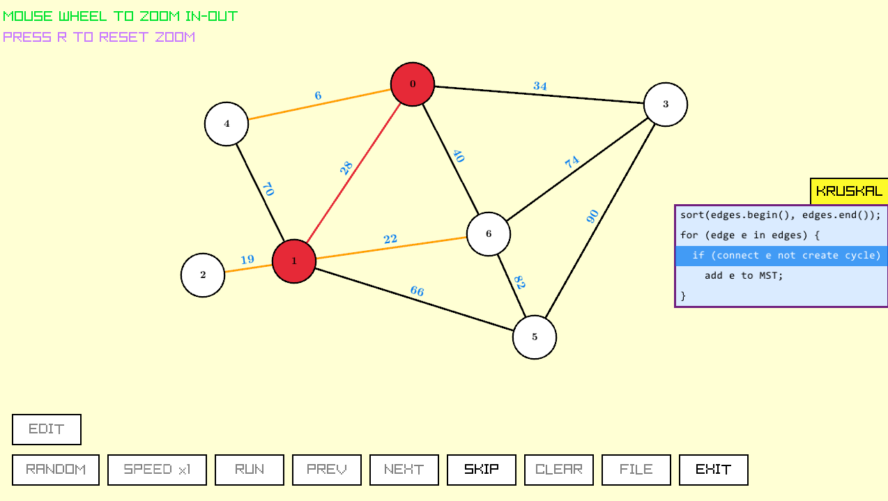

# Data Structures & Graph Algorithms Visualizer


An interactive, user-friendly visualization tool designed to help students and developers understand the internal mechanics of data structures and fundamental graph algorithms. Built completely from scratch using **C++** and the **Raylib** graphics library.



---

## Features

This visualizer supports visualizing the following data structures and graph algorithms.
### Data Structures
* **Singly Linked List**.
* **Max Heap**.
* **AVL Tree**.
* **Trie**.

### Graph Algorithms
* **Minimum Spanning Tree** using **Kruskal's Algorithm** (with Disjoint Set Union).
* **Shortest Path** using **Dijkstra's Algorithm**.

### Interactive UI/UX
* **Step-by-Step State Management:** Pause, rewind (previous step), and skip to the final result of any algorithmic operation.
* **Customizable Themes:** Switchable color themes and node styles.
* **Cross-platform File Dialogs:** Seamlessly load graph data using native OS file explorers.

---

## Prerequisites & Setup (Windows)

To compile and run this project locally, ensure you have the following installed:

1. **C++ Compiler (MinGW-w64):** The `g++` compiler supporting C++17.
2. **Make:** GNU Make for building the project.
3. **Raylib:** The project expects Raylib to be installed at `C:/raylib/raylib`. 
   *(If you use the official Raylib Windows Installer, it will automatically setup w64devkit and the correct folder structure).*
---

## How to Build & Run

**Step 1: Clone the repository**
```bash
git clone [https://github.com/your-username/your-repo-name.git](https://github.com/your-username/your-repo-name.git)
cd your-repo-name
```

**Step 2: Compile the project**

Open your terminal (make sure your compiler is in the system PATH) and simply run:
```bash
make
```
This will compile all `.cpp` files in the directory and link the necessary Raylib, OpenGL, and Windows API libraries (`-lole32`, `-lcomdlg32`, etc.).

**Step 3: Run the Visualizer**

Once compiled successfully, an executable named `DataVisualizer.exe` will be generated. Run it using:
```bash
./DataVisualizer.exe
```

**Clean Build Files:**

If you want to recompile everything from scratch, clean the object files (`.o`) and the executable by running:
```bash
make clean
```

# Credits
- `tinyfiledialogs` library by Guillaume Vareille.